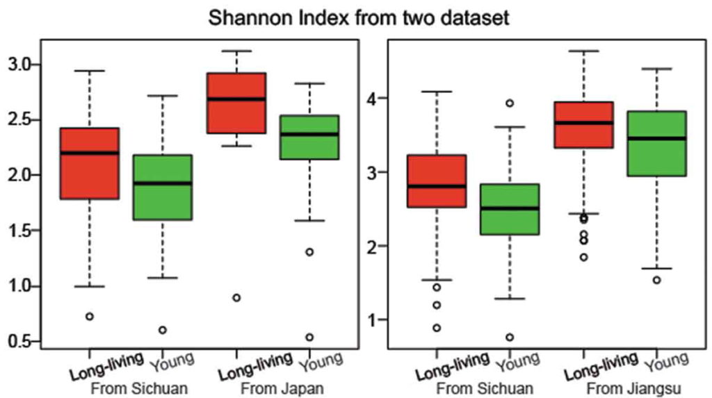
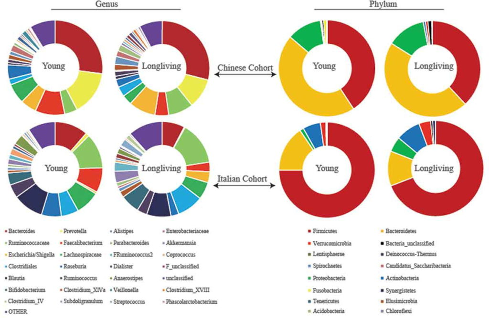
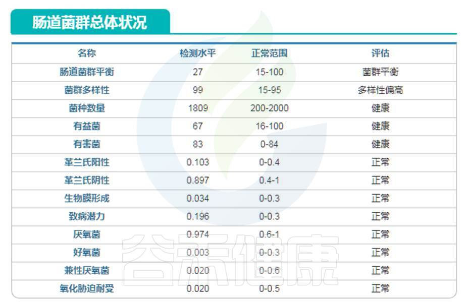
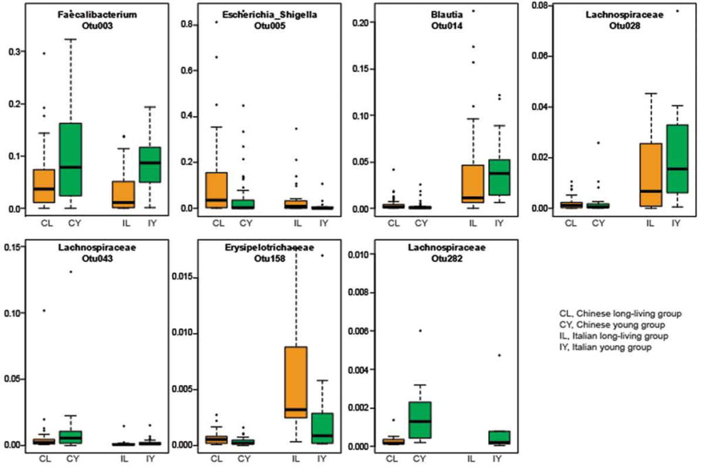
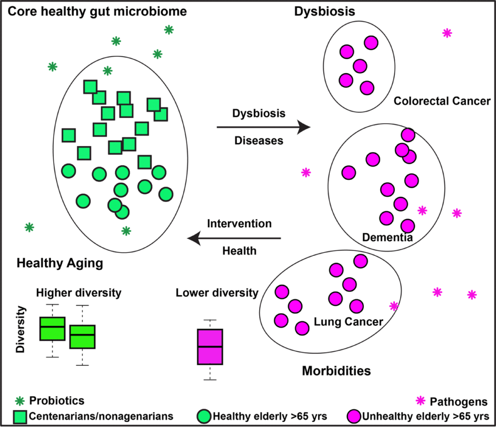
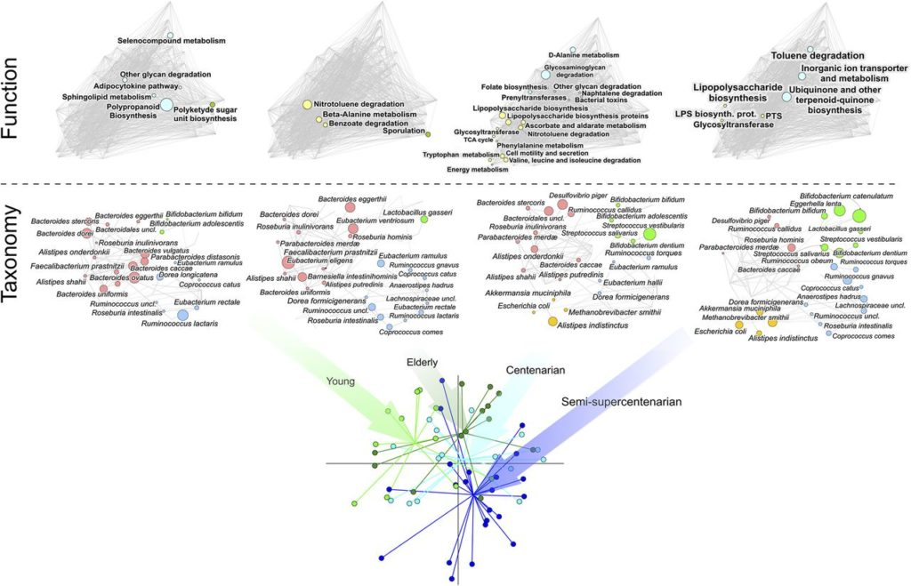
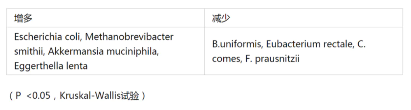
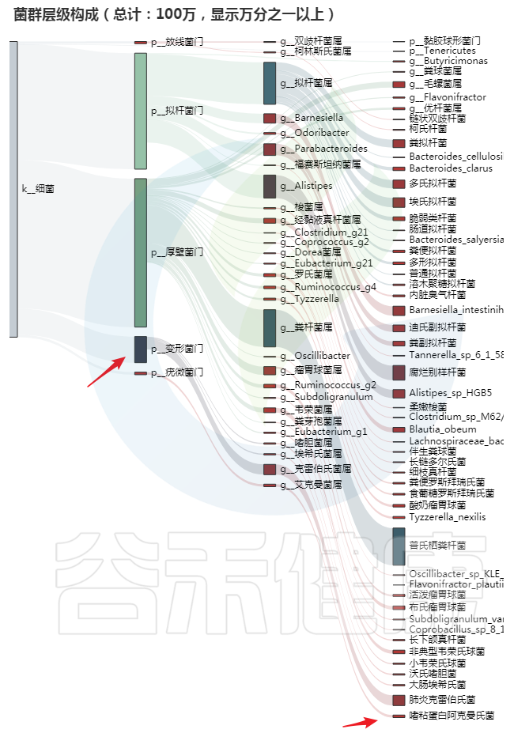
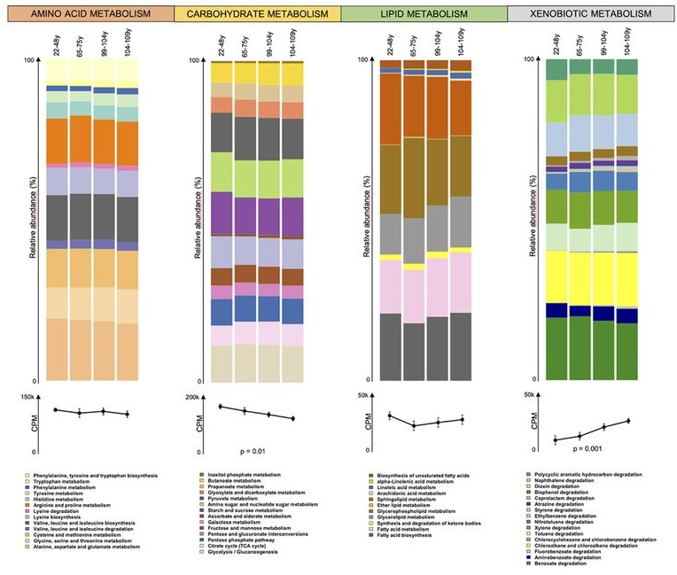
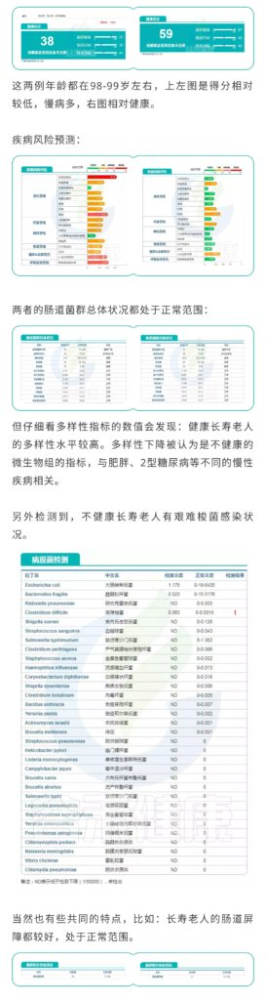

## [解密|肠道菌群与长寿【跨年礼】](http://www.guhejk.com/wordpress/?p=3274)

**谷禾健康**

过完今天，这个魔幻的2020就要过去了。面临工作、学习、出行等方方面面一而再地按下暂停键，很多人都希望这一年能够重启。

这一年发生了太多故事

每一个都足以让人痛惜

“活着”、“健康”这样的字眼在这一年显得尤为珍贵。简单的道理往往在经历重大的事件后才会尤为深刻。

古有求仙药，今有各种医疗技术的不断革新，大家对于长寿有着一致的追求。当基本的生活有了一定的保障后，人们不仅想要活得长久，还要健健康康地活着。

我们可以看到，人类的预期寿命已开始延长，并且仍在继续提高。“健康长寿”不再停留于一句祝福语，而是可行的人生目标。

## 01 **关于长寿的研究**

长寿是多种变量复杂组合的结果。由于不同地区自然环境、社会制度、社会经济发展状况和人口构成等因素千差万别。

根据相关研究，影响人类寿命的因素至少包括：

**遗传因素**如线粒体状态、染色体稳定性、端粒长短、疾病、干细胞活性；

**环境因素**如肠道微生物、饮食、运动、空气质量以及生活环境；

**其他因素**如情绪压力、社交爱情、目标成就、投入预防等等。

人们在迈向健康长寿的过程中处于不同的阶段和水平。若干年后，也许有相当多的人进入百岁人生。

在2020年的最后一天，我们就来聊聊肠道菌群和长寿的故事。

伊卡里亚岛

**伊卡里亚岛**

该岛位于萨摩斯岛西南约10海里，这是爱琴海的一个小岛，是世界上寿命最长的地区之一。他们是90岁以上人群中世界上人口最多的国家，百岁老人在岛上已有400多年的历史了。科学家将那里长寿的机会与空气，水，社区精神，饮食习惯和遗传倾向等因素相关联。

**意大利**

提起意大利，你想到的是足球还是意大利面，其实这个国家还盛产长寿老人，根据欧盟统计，意大利为欧洲第一长寿国，女性平均寿命为84岁，男性平均寿命为78.3岁。

研究发现100岁意大利老人的肠道菌群种类分布与30岁意大利人相比，出现了较明显的变化，厚壁菌门中的拟杆菌XIVa明显减少，而芽孢杆菌上升，身体的炎症反应状况高，因此科学家得出长寿的关键因素：菌群种类的改变，更好的应对和调节炎症反应。

**中国** **新疆和田，广西巴马，四川都江堰青城山等**

中国新疆和田，广西巴马以及四川都江堰市青城山等地区都很大比例的长寿健康老人。动物遗传育种研究所李英团队在《Current Biology》发表的一项关于寿老人和年轻人群肠道菌群研究发现长寿老人肠道菌群多样性和菌群丰度显著高于年轻组，这一结论在意大利相应人群中也得到了证实，提示更多有益菌群以及更丰富的菌群多样性可能是人类健康长寿的重要原因之一。

## 02 **长寿老人肠道微生物群特征**

对长寿的研究可能有助于我们理解人类是如何延缓衰老，如何战胜与年龄相关的疾病。

肠道微生物群被认为是监测和可能支持健康衰老的变量之一。事实上，**宿主-肠道微生物体内平衡的破坏与炎症和肠道通透性以及骨骼和认知健康的普遍下降有关**。肠道微生物群作为健康衰老可能的介质，通过对抗炎症、肠道通透性以及认知和骨骼健康的恶化来保持宿主环境的稳态。

健康老年人的肠道菌群如何定义？

考虑到大多数老年人都患有肠道相关合并症，因此在该人群中定义健康的肠道微生物组极具挑战性。肠道环境的变化，例如炎症，肠道渗漏，活性氧的产生以及药物的使用，都可能影响肠道微生物组。在这方面，**健康****百岁老人**一直被用作健康老龄化的典范，因为他们有能力推迟或避免慢性疾病。因此，该队列中的肠道微生物组可用于定义健康的肠道微生物组。

**长寿者肠道菌群多样性水平高**

一般认为，随着年龄增长时，肠道微生物多样性通常会**降低**。可能是由于生理，饮食，药物和生活方式的变化所致。

是不是所有老人的肠道菌群多样性都会降低？

研究人员检测了一群健康的长寿老人的肠道微生物组，来自中国四川都江堰市的长寿老人，包括“90-99岁”和“≥100岁”两个年龄段。

他们发现长寿人群的肠道菌群比年轻成年人的肠道菌群**更多样化**，这与传统观点相矛盾。

  
Kong F，et al., 2018; Gut Microbes

他们还发现了产短链脂肪酸菌在长寿老人中开始增加，例如梭状芽胞杆菌XIVa。

国内外研究结果一致

为了验证他们的发现，他们分析了来自一个意大利小组的独立数据集。

  
Kong F，et al., 2018; Gut Microbes

出现一致的结果：**长寿的意大利人也比年轻的人群的肠道菌群多样化水平更高** 。

庆幸的是，谷禾肠道菌群数据库中也有比较长寿的老人肠道菌群数据。

我们抽取其中一例相对较为健康的长寿老人的数据：

编号：083\*\*\*\*\*97 ，98岁（谷禾肠道菌群数据库）

谷禾健康数据库

可以看到肠道菌群多样性水平也是明显增高，与文献报道相符。大部分指标都处于正常水平。

**长寿者产短链脂肪酸菌增多**

结合意大利和中国的数据集，发现尽管肠道微生物群结构存在显著差异(可能是由于饮食、基因和环境的差异)，但区分长寿个体和年轻群体的前50种细菌特征中，有**11种特征是相同的**。同样，这些特征包括**肠道菌群多样性水平更高**和几个**产短链脂肪酸菌丰度更高**。

  
Kong F，et al., 2018; Gut Microbes

一项后续研究中，另外两个独立的队列中也观察到了长寿人群中更大的肠道微生物组多样性：一个来自中国江苏省，另一个来自日本。

以上这些研究都清楚地表明，**健康长寿的人存在更多样化且平衡的肠道菌群**，而在患有不同合并症的老年人中观察到肠道菌群紊乱。

因此，研究人员假设调节肠道微生物组(如通过饮食、益生菌)来维持健康的肠道微生物组将有利于健康地衰老。

进一步假设，在患有慢性疾病的老年人中，将紊乱的肠道菌群调节为健康的肠道菌群将减轻他们的症状，提高他们的生活质量。

肠道微生物组和健康衰老的有效假设

  
Deng et al., 2019; Aging

该假设背后的一个基本原理是慢性炎症，即老年人中慢性低度炎症的增加，这与不同的慢性疾病有关。

短链脂肪酸对维持肠道止血很重要。短链脂肪酸为结肠上皮细胞提供主要能量，并具有抗炎特性。这些**产短链脂肪酸菌在长寿老人中的富集**表明，这些细菌可能会**减轻炎症****及由此造成的损害**，这可能是他们能够健康衰老的原因。

以上我们知道长寿老人的产短链脂肪酸菌增多，那么其他菌群会有什么样的变化？

在门类水平上，大多数研究都证明了**变形菌**丰度的增加。

 **长寿者菌群变化，潜在有益菌较多** 

**· 不同地区比较：**

一项研究分析并比较了长寿村庄中百岁老人与同一地区和城市化城镇中的老年人和成年人的肠道菌群。采集长寿村的百岁老人、老年人和年轻人的粪便样本，以及来自韩国城市城镇的老年人和年轻人的公共数据库获得肠道菌群数据。

与城镇化老年人相比，长寿村老人：

康复医院百岁老人的肠道菌群也不同于居家。这些差异可能是由于**饮食方式**和**生活环境**的差异。

**· 不同年龄比较：**

我们来看一项研究，对62个人的粪便微生物组进行宏基因组测序，年龄从22岁至109岁不等。

下图可以看到，随着年龄的增长，肠道微生物群发生了变化。

  
Rampelli et al., 2020; mSystems

注：4个年龄组的肠道微生物组:

11个年轻人 (22 – 48岁,young); 

中年13人 (65 – 75岁,elderly);

15名百岁老人 (99至104岁, centenarian);

23名半超百岁(105至109岁，semisupercentenarian)

研究人员发现与年轻人相比，长寿者菌群变化如下：

编号：083\*\*\*\*\*97 ，98岁**（谷禾肠道菌群数据库）**

我们发现同样，变形菌门增加，另外有益菌如阿克曼菌增多。

## 03 **长寿者肠道菌群代谢相关变化**

**长寿者碳水化合物代谢相关基因减少**

有趣的是，当研究人员将分析集中在功能规模上时，发现与碳水化合物代谢有关的基因减少。

  
Rampelli et al., 2020; mSystems

这种功能重塑在百岁老人和半超百岁老人的肠道微生物组中更为明显，研究人员观察到淀粉和蔗糖（KEGG途径编号ko00500），磷酸戊糖（ko00030）以及氨基糖和核苷酸糖（ko00520）途径的贡献**减少**。

**异种生物降解有关的基因数量增加**

同时，研究人员发现了和甲苯（ko00623），乙苯（ko00642），己内酰胺（ko00930）以及氯环己烷和氯苯（ko00361）降解途径的随之**增加**。

乙苯，氯苯，氯环己烷，甲苯是主要来源于**工业生产和城市排放的普遍化学物质**，由于其毒性作用，是世界各地监测的主要**环境污染物**之一。这些分子的主要人造来源实际上是汽车和废气汽车的排放，以及香烟烟雾。

此外，众所周知，它们是在加工精制石油产品(如塑料)的过程中产生的，并包含在普通消费产品(如油漆和漆、稀释剂和橡胶产品)中。

**己内酰胺**是尼龙的原料，用于生产合成纤维、树脂、合成皮革、增塑剂等多种室内产品。先前的研究表明，这些分子在室内的负担比在室外环境中更高，并强调了室内暴露对人类健康的特殊重要性。

生活在强人为下的环境中，例如意大利的艾米利亚-罗马涅区（工业发达），导致持续不断地暴露于这些普遍的异生物质中，促进它们在身体组织（包括肠道）中的维持和累积。

研究人员认为，这可以为人类宿主创造合适的条件，以选择能够解毒此类化合物的肠道微生物组成分，就微生物组和宿主在人类环境中的适应性而言互惠互利。

百岁和半百岁的人都是长寿的人，他们接触异生生物刺激的时间更长，他们的微生物群更适合降解这些异生生物。

**脂质代谢基因变化**

除了异物降解基因和糖代谢相关基因外，我们还发现了其他代谢途径中与年龄相关的差异，包括与脂质代谢有关的差异。

百岁老人和半超百岁老人显示出更多的**α-亚油酸**（KEGG途径编号ko00592）和**甘油脂**(ko00561)代谢的信息。另一方面，年轻人显示鞘脂(ko00600)和甘油磷脂(ko00564)代谢相关基因的贡献更大。

鉴于已知甘油磷脂和鞘脂在动物源性食品中更为丰富，而α-亚油酸主要来自植物源食物，这些特征可能与**饮食习惯**有关，特别是长寿者的植物源性脂肪摄入量高于年轻人的动物脂肪摄入量。

**氨基酸代谢基因变化**

此外,涉及氨基酸代谢的功能途径：

**色氨酸**（ko00380）**，酪氨酸**（ko00350）**，甘氨酸，丝氨酸和苏氨酸**（ko00260）的代谢基因随着年龄的增长而逐渐增加。

另一方面，发现年轻人中丙氨酸，天冬氨酸和谷氨酸代谢的基因（ko00250）更为丰富。色氨酸和酪氨酸的代谢被认为是蛋白水解代谢增强的指标。

此外，血清中**色氨酸的生物利用度降低**，以及尿液中酪氨酸代谢引起的**酚类代谢产物水平升高**。

**慢性炎症水平低**

研究人员发现随着衰老，脂多糖生物合成基因(ko00540)逐渐增加，这可能与病原菌（即肠杆菌科的成员）的存在和慢性炎症的水平低有关。

## 04 **健康长寿和不健康老人的菌群差异**

然而，更长的寿命并不一定等于健康的衰老。随着年龄的增长，人们更有可能患上各种疾病，如心脏病、中风、高血压、认知障碍、癌症等。

前面章节有一项研究（长寿村老人与城镇化老人肠道菌群）提到，来自不同地区的老人，虽然都是长寿，但菌群情况**不尽相同**。

因此，我们想更具体地了解，同样是长寿老人，健康长寿和不健康长寿具体到个人，在哪些方面会有区别。我们抽取谷禾肠道菌群数据库中两例报告来进行直接比较分析。

## 05 **健康长寿的预测**

以上只是数据库中的两个案例，在经过谷禾肠道菌群数据库筛查后，我们总结了一些关于长寿老人（90岁以上）的肠道菌群的趋势，分享关于报告中的一些指标判断，供大家参考。

 健康总分 

健康总分能很好的反映一个人的总体健康水平，有慢病或其他问题的老人一般低于55分。

 菌群多样性

菌群多样性健康长寿老人的菌群多样性水平最好能高于50，菌种数量在1000~1800左右较好，超过2000则可能会伴有病原菌感染的情况。

 慢病情况

主要是心脑血管及糖尿病和部分消化道疾病，涉及慢性炎症和代谢疾病。

 病原菌

病原菌感染是老人中最常出现的问题，包括呼吸道和肠道病原菌，随着衰老，肠杆菌科的部分机会致病菌比例会上升，需要注意饮食健康，以及呼吸道健康和口腔健康。

 肠道屏障及炎症水平

长寿老年人中Akk菌水平普遍较中年人群较高，Akk菌有助于降低肥胖等代谢疾病，但是Akk菌丰度过高会导致肠粘膜黏蛋白降解，破坏肠道屏障，也是需要注意的指标。

 短链脂肪酸水平 

短链脂肪酸生成的菌的水平与短链脂肪酸和炎症水平密切相关，短链脂肪酸缺乏通常是慢性炎症的推手。

 益生菌水平 

在谷禾检测的90岁以上人群中，益生菌水平普遍较高，基本超过人群平均水平。

06 **长寿者避雷专区——谣言粉碎机**

信息爆炸的时代，我们可以轻易获得大量关于营养保健的信息，然而其中大多数可能是不正确或者过时的观念。

1\. 减肥仅靠控制热量？

我们都知道，减肥需要燃烧比摄入更多的能量，但这不是唯一。那些遵循“卡路里摄入，卡路里消耗”方法的人通常只专注于食物的卡路里值，而不是其营养价值。这对于整体健康而言，并非最佳选择。

如果出现体内激素失调，甲状腺功能低下，代谢状况，药物使用等健康问题，可能即使在严格饮食下也难以减轻体重。

2\. 高脂食物不健康？

许多人仍然担心高脂肪的食物并遵循低脂肪的饮食习惯，认为减少脂肪的摄入有益于整体健康。

膳食脂肪对于保持最佳健康至关重要。另外，低脂饮食与包括代谢综合征在内的健康风险更高有关，并且可能导致胰岛素抵抗和甘油三酸酯水平升高，这是已知的心脏病危险因素。

而且，在鼓励减肥方面，高脂肪饮食已被证明比低脂肪饮食有效（甚至更高）。

当然，无论是低脂还是高脂饮食，任何一种极端情况都可能危害健康。尽可能遵循“中庸之道”。

​

3.非营养性甜味剂是健康的？

市场上出现越来越多的非营养性甜味剂（NNS）的产品有所增加。显然，高糖饮食会大大增加疾病的风险，但摄入NNS也会导致不良的健康后果。

例如，摄入NNS可能会引起肠道菌群产生负面变化并促进血糖失调，从而增加2型糖尿病的发病率。

该领域的研究仍正在进行中，未来需要高质量研究来确认这些潜在的联系。

4\. 你必须很瘦才能健康？

我们知道，肥胖与许多健康状况相关，包括2型糖尿病，心脏病，抑郁症，某些癌症等。

尽管如此，降低疾病风险并不是说要你必须要达到模特身材。最重要的是营养饮食并保持积极的生活方式，因为这些行为通常会改善体重和体内脂肪百分比。

​

5\. 所有食物都用低脂和减肥食品来代替？

去超市你会发现各种标有“清淡”，“低脂”，“无脂”的产品。虽然这些产品对那些想要减少体内多余脂肪的人来说很诱人，但它们通常是不健康的选择。

研究表明，许多低脂和减肥食品所含的糖和盐要比普通脂肪食品多得多。最好不要经常食用这些产品，有时候也可以享受一下正常食物，例如全脂酸奶，奶酪和坚果黄油。

6\. 钙补充剂对骨骼健康必不可少？

很多人听说添加钙补充剂以保持骨骼系统健康。但是，目前的研究表明，补充钙可能弊大于利。

例如，一些研究已将钙补充剂与心脏病风险增加联系起来。此外，研究表明，它们不会降低骨折或骨质疏松症的风险。

当然，如果你担心缺钙，最好注意下钙的饮食来源，例如全脂酸奶，沙丁鱼，豆类和种子食物等。

7.所有果汁和果汁都是健康的 ？

某些果汁营养丰富。例如，主要由非淀粉类蔬菜制成的新鲜果汁可以是增加维生素，矿物质和抗氧化剂摄入量的好方法。

然而，要知道外面买到的大多数果汁中都含有糖和卡路里。如果过量食用，会促进体重增加和其他健康问题，例如蛀牙和血糖失调。

8\. 每个人都需要补充益生菌？

益生菌的概念现在越来越火。但是，研究表明，不是所有人补充益生菌都有用，搞不好有副作用。

某些人的消化系统对益生菌的定殖有抵抗力，而且通过补充剂引入益生菌可能会导致肠道细菌产生负面变化。另外，与益生菌使用相关的小肠细菌过度生长会导致腹胀，气体和其他不良副作用。

益生菌不应作为千篇一律的补充剂，而应更加个性化，最好在做完肠道菌群检测之后再确定是否需要补充益生菌，补充哪一类益生菌，这样才能真正让身体恢复健康。

​

9\. 减肥很容易？

你可能看过很多生动的减肥前后的图片，甚至还有传奇的故事，几乎不费吹灰之力就可以迅速减肥的故事，不要随意相信。

减肥其实并不容易。它需要坚持不懈，自律，努力和耐心。另外，由于遗传或其他药物因素使某些人的减肥困难很大，我们需要正视这一切，面对它，慢慢来，给自己多一点耐心，找到一种对你有效的可持续的模式最重要。

10\. 纤维补充剂是高纤维食品的良好替代品？

许多人缺乏足够的膳食纤维，这就是为什么纤维补充剂如此受欢迎的原因。尽管纤维补充剂可以改善肠蠕动和血糖控制，从而有益于健康，但它们不应代替真正的食物。

高纤维全食（例如蔬菜，豆类和水果）包含营养物质和植物化合物，它们可以协同工作以促进您的健康，并且不能完全由纤维补充剂替代。

 LONGEVITY

随着时代的不断发展，旧的观念也在不断更新。曾经的认知也许是“七十古来稀”，而现如今更多的是百岁人生。

我们的追求也会越来越高，不仅是长寿，更是健康的长寿。可以预见，长寿时代将促使健康产业结构升级。

是的，微生物产业作为健康领域的其中一块，发展迅速。值得庆幸的是，在应对突如其来的疫情下，肠道微生态也在被应用于治疗，技术的革新为提高健康水平提供有力支撑，各个制度完善也在为健康领域的可持续发展构建强大保障，人类命运共同体正彰显其感召力。

而**谷禾健康**作为微生物产业的一员，自2012年创立起，对于科研事业一直贡献着自己的力量，与此同时，这么多年来，谷禾一直希望将科研真正服务于大众，将科研成果带给每一个人，这是我们的使命。

现如今，我们也已经看到阶段性硕果。曾经，“肠道菌群”还只是一个概念，谷禾健康从肠道菌群的研究构思，到取样专利的落地，肠道菌群检测报告逐步完善，再到样品运输的细节管理，我们都在经历从0到1的过程，勇于创新，不断摸索，在微生物产业的道路上，迈着坚定的步伐。

令我们感到欣慰的是，“肠道菌群”现已逐渐从研究过渡到临床甚至普通人群，并且从模糊的健康概念走向精准检测甚至个性化辅助治疗。

> 2021寄语
> 
> 愿你所有努力都有回报
> 
> 所有的美好都如期而至

参考文献：

Kong F, Deng F, Li Y, Zhao J. Identification of gut microbiome signatures associated with longevity provides a promising modulation target for healthy aging. Gut Microbes. 

2019;10(2):210-215. doi: 10.1080/19490976.2018.1494102. Epub 2018 Aug 24. PMID: 30142010; PMCID: PMC6546316.

Rampelli S, Soverini M, D’Amico F, Barone M, Tavella T, Monti D, Capri M, Astolfi A, Brigidi P, Biagi E, Franceschi C, Turroni S, Candela M. Shotgun Metagenomics of Gut Microbiota in Humans with up to Extreme Longevity and the Increasing Role of Xenobiotic Degradation. mSystems. 2020 Mar 24;5(2):e00124-20. doi: 10.1128/mSystems.00124-20. PMID: 32209716; PMCID: PMC7093822.

Deng F, Li Y, Zhao J. The gut microbiome of healthy long-living people. Aging (Albany NY). 2019 Jan 15;11(2):289-290. doi: 10.18632/aging.101771. PMID: 30648974; PMCID: PMC6366966.

Kim BS, Choi CW, Shin H, Jin SP, Bae JS, Han M, Seo EY, Chun J, Chung JH. Comparison of the Gut Microbiota of Centenarians in Longevity Villages of South Korea with Those of Other Age Groups. J Microbiol Biotechnol. 2019 Mar 28;29(3):429-440. doi: 10.4014/jmb.1811.11023. PMID: 30661321.